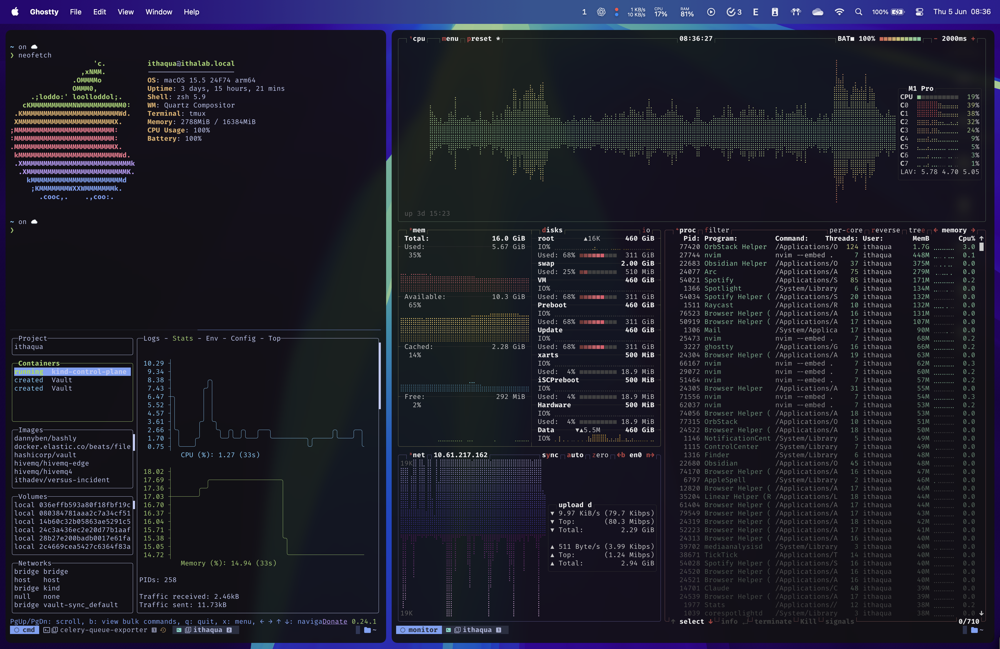

# Ithadev's environment files

This repository stores the dotfiles and configuration files for my development
environments. It also includes a command-line tool built using
[`bashly`](https://github.com/DannyBen/bashly), a framework for generating Bash
command-line tools. The tool provides a streamlined way to manage and apply
these configurations.

> [!WARNING]
> Don't blindly use my settings unless you know what that entails.
> Use at your own risk!

## Preview

- 

- 

- 

## What i setup for my dev environment?

This repository includes configuration files for the following tools:

- [nvim](https://github.com/neovim/neovim)
- [tmux](https://github.com/tmux/tmux)
- [mise](https://github.com/jdx/mise)
- [neofetch](https://github.com/dylanaraps/neofetch)
- [yabai](https://github.com/koekeishiya/yabai) - Deprecated
- [skhd](https://github.com/koekeishiya/skhd) - Deprecated
- [starship](https://github.com/starship/starship)
- [wezterm](https://github.com/wez/wezterm)
- [ghostty](https://github.com/ghostty-org/ghostty)
- [zsh](https://github.com/zsh-users/zsh) + [ohmyzsh](https://github.com/ohmyzsh/ohmyzsh)
- [btop](https://github.com/aristocratos/btop)
- [fabric](https://github.com/danielmiessler/fabric/tree/main)
- [k9s](https://github.com/derailed/k9s)
- [aerospace](https://github.com/nikitabobko/AeroSpace)
- [to-obsidian-note](https://github.com/ithaquaKr/to-obsidian-note)

## Setup

### Requirements

- All dependencies those tools needed.

### Using CLI

My repository support a bash script CLI tool offers the following features:

- **List Available Configs**: List all configurations stored in the repository.
- **Apply All Configs**: Apply all available configurations in one go.
- **Apply Individual Configs**: Apply configurations for a single tool or service.
- **Remove Configs**: Remove applied configurations from your environment.

```sh
❯ ./ithactl --help
ithactl - Command Line Tools for using ithadev's environment files.

Usage:
  ithactl COMMAND
  ithactl [COMMAND] --help | -h
  ithactl --version | -v

Commands:
  list     List of configurations that can be applied.
  apply    Apply configurations.
  all      Apply all configurations.
  remove   Remove configurations.

Options:
  --help, -h
    Show this help

  --version, -v
    Show version number
```

## Contributing

Feel free to fork this repository and submit pull requests if you have
improvements or new configurations that could enhance this setup.

### Reporting issues

If you encounter any issues, please open an issue on the [GitHub Issue Tracker](https://github.com/ithaquaKr/dev-environment-files/issues).

## License

This repository is licensed under the MIT License.

---

Made with ❤️ by ithaquaKr
